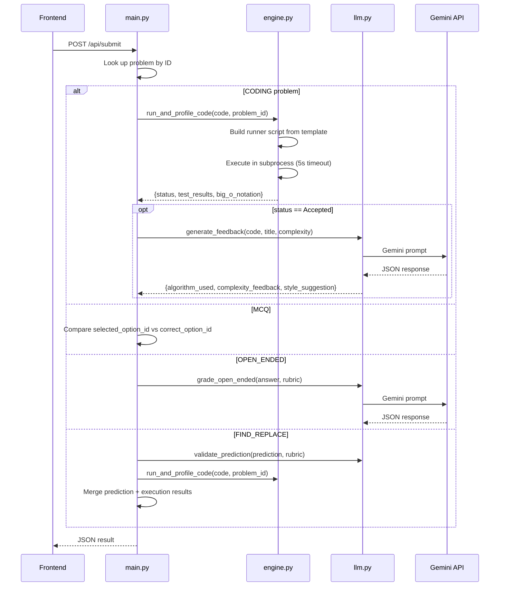

# Software Architecture Document — AI Coder Platform

## 1. System Overview

The platform is a two-tier, locally-hosted web application:

```
┌─────────────────────┐         HTTP (REST)         ┌──────────────────────┐
│   Next.js Frontend  │  ◄────────────────────────►  │   FastAPI Backend    │
│   (TypeScript/React) │       localhost:3000 → 8000  │   (Python 3.9+)     │
└─────────────────────┘                              └──────────────────────┘
                                                              │
                                                     ┌───────┴────────┐
                                                     │  Gemini API    │
                                                     │  (google.ai)   │
                                                     └────────────────┘
```

## 2. Backend Architecture

### 2.1 Module Map

```
backend/
├── main.py           # FastAPI app — routes, CORS, request dispatch
├── engine.py         # Sandboxed code execution & big-O profiling
├── llm.py            # Gemini integration — feedback, grading, validation
├── problems.json     # Problem definitions (static data store)
├── requirements.txt  # Direct Python dependencies
├── .env              # GEMINI_API_KEY (gitignored)
└── .env.example      # Template for the above
```

### 2.2 Request Flow



### 2.3 Code Execution Sandbox

`engine.py` uses a **template-injection** approach:

1. A Python runner template contains test-runner and profiler logic.
2. User code and problem-specific test cases are injected via string formatting.
3. The assembled script runs in a **subprocess** using `sys.executable` (same venv).
4. Output is captured as JSON on stdout; stderr indicates errors.
5. Error line numbers are adjusted by subtracting the template's line offset (`_USER_CODE_LINE_OFFSET = 15`).

**Security note:** Code runs without a true sandbox (no Docker, no seccomp). This is acceptable for local-only use.

### 2.4 LLM Integration

`llm.py` wraps three Gemini calls behind a consistent pattern:

1. Check for API key → return graceful fallback if missing.
2. Build a prompt with system instructions + user data.
3. Request strictly-JSON output (no markdown fences).
4. Parse with shared `_parse_json_response()` helper.
5. Return structured dict on success, error dict on failure.

### 2.5 Data Model

Problems are stored as a flat JSON array in `problems.json`. Each entry:

```json
{
  "id": "string",
  "type": "CODING | FIND_REPLACE | MCQ_THEORY | MCQ_CODING | MCQ_REAL_WORLD | MULTIPLE_CHOICE | OPEN_ENDED",
  "title": "string",
  "description": "markdown string",
  "signature": "string | null      (starter code for CODING/FIND_REPLACE)",
  "rubric": "string | null          (grading criteria for OPEN_ENDED/FIND_REPLACE)",
  "options": "[{id, text}] | null   (for MCQ types)",
  "correct_option_id": "string | null (for MCQ types)"
}
```

## 3. Frontend Architecture

### 3.1 Component Tree

```
page.tsx (Home)
├── Sidebar                  — Problem list + status badges
├── Header                   — Title, timer, submit/next buttons
├── PanelGroup (horizontal)
│   ├── Problem Description  — Markdown-rendered problem text
│   └── Workspace Panel
│       ├── MCQWorkspace         — Option cards (MCQ types)
│       ├── OpenEndedWorkspace   — Textarea (OPEN_ENDED)
│       └── CodeWorkspace        — Monaco editor + ConsoleOutput
│           └── ConsoleOutput    — Test results, complexity, AI feedback
```

### 3.2 State Management

All state lives in the `useProblemStore` custom hook:

| State              | Scope   | Description                                                               |
| ------------------ | ------- | ------------------------------------------------------------------------- |
| `problems`         | Global  | List of all problem summaries                                             |
| `currentProblemId` | Global  | Currently selected problem                                                |
| `problem`          | Derived | Full problem object for current ID                                        |
| `store`            | Global  | `Record<problemId, ProblemState>` — per-problem code, selections, results |
| `isRunning`        | Global  | Whether a submission is in-flight                                         |

State persists across problem navigation within a session (stored in the `store` map) but is **not** persisted across page reloads.

### 3.3 API Communication

All API calls go to `http://localhost:8000` (hardcoded `API_BASE` in `useProblemStore.ts`):

| Endpoint            | Method | Purpose                                   |
| ------------------- | ------ | ----------------------------------------- |
| `/api/problems`     | GET    | List all problems (id, title, type)       |
| `/api/problem/{id}` | GET    | Get single problem (answer keys stripped) |
| `/api/submit`       | POST   | Submit answer for evaluation              |

## 4. Technology Stack

| Layer               | Technology    | Version                                      |
| ------------------- | ------------- | -------------------------------------------- |
| Frontend framework  | Next.js       | 14.x                                         |
| Language (FE)       | TypeScript    | 5.x                                          |
| Styling             | Tailwind CSS  | 3.4.x                                        |
| Code editor         | Monaco Editor | via `@monaco-editor/react`                   |
| Backend framework   | FastAPI       | ≥ 0.100                                      |
| Language (BE)       | Python        | 3.9+                                         |
| LLM                 | Google Gemini | `gemini-2.5-flash` via `google-generativeai` |
| Complexity profiler | `big-O`       | 0.11.x                                       |

## 5. Key Design Decisions

| Decision                                        | Rationale                                                     |
| ----------------------------------------------- | ------------------------------------------------------------- |
| File-based problem store (JSON)                 | No DB needed for 13 problems; hot-reload without restart      |
| Subprocess execution (not Docker)               | Simplicity for local dev; no container overhead               |
| `sys.executable` for subprocess                 | Portable across machines; no hardcoded paths                  |
| Template string injection for runner            | Keeps test logic co-located; avoids needing a test framework  |
| Per-problem state map (not per-component state) | Preserves student progress when switching between problems    |
| Monolithic API (no microservices)               | 3 routes, 1 process — microservices would be over-engineering |

## 6. Limitations & Known Constraints

- **No real sandboxing** — user code can access the filesystem and network.
- **Python 3.9** — venv uses an EOL Python version; modern type hints require `typing` imports.
- **No persistence** — all progress is lost on page reload.
- **Single-user** — no auth, no concurrency handling for code execution.
- **Hardcoded API base** — frontend assumes backend runs on `localhost:8000`.
